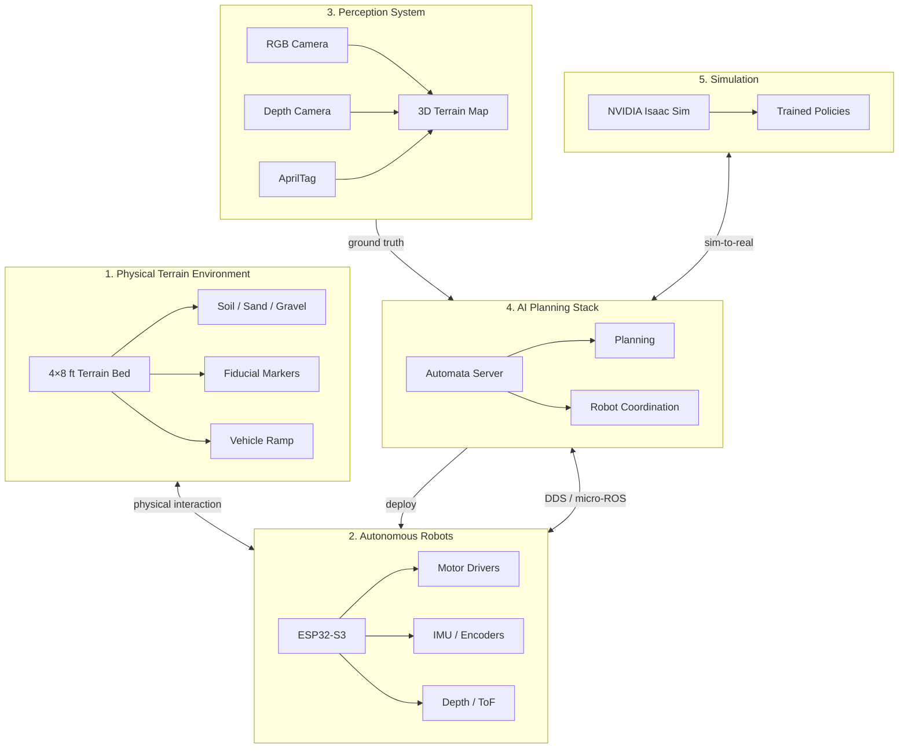
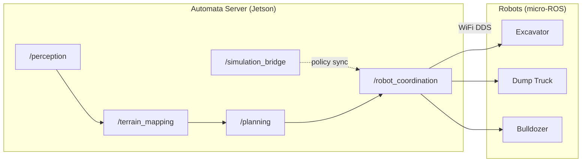
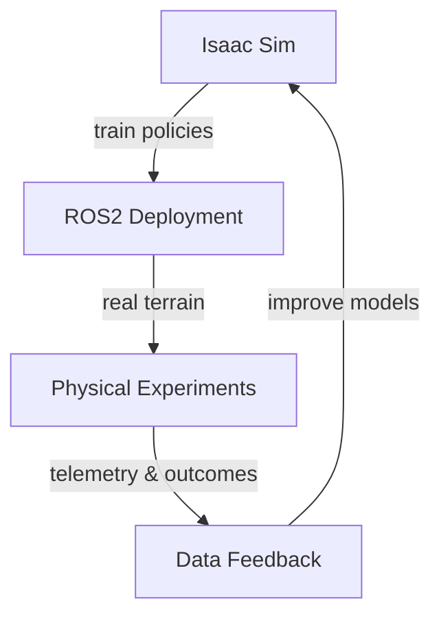
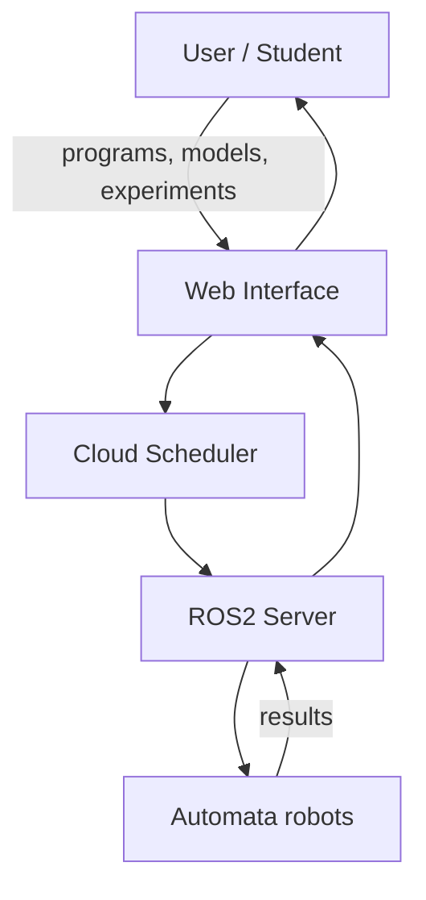
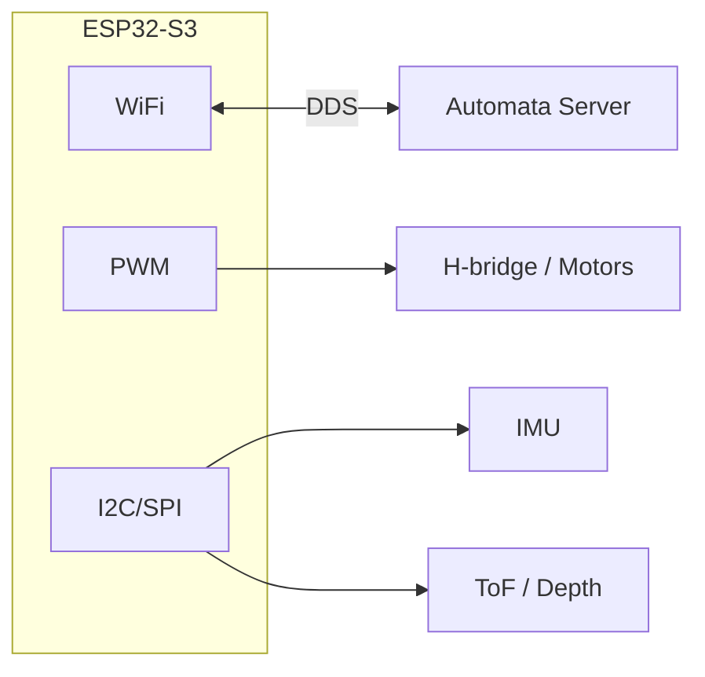

# Automata Architecture

System overview and data flow for the Castalia Automata embodied AI platform.

## Five-Layer System

## ROS2 / DDS Topology

## Sim-to-Real Loop

## Remote Lab Access

## Robot Node (ESP32-S3)

See [Automata-Design.md](Automata-Design.md) for full specification.
